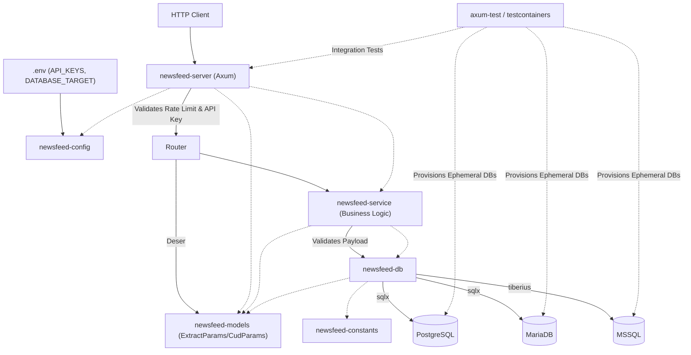

# Knowledge Graph

## Conceptual Mappings
- **Authentication**: `X-API-Key` HTTP Header -> `HashSet<String>` in `AppState`.
- **Database Routing**: `DATABASE_TARGET` env var -> Instantiates specific `DbPool` enum variant -> Routes to `postgres.rs`, `mariadb.rs`, or `mssql.rs`.
- **Legacy Python**: `constants.py` -> `newsfeed-constants`; `newsfeedwebservice.py` -> `newsfeed-service` & `newsfeed-server`.
- **Error Standardization**: Malformed payloads -> `AppJson` Extractor -> Structured JSON mapped to unified constants (e.g. `Code: "BAD_REQUEST"`).
- **Build System**: `cargo-make` (`Makefile.toml`) powers all cross-platform builds and checks.
- **Continuous Integration**: GitHub Actions workflows execute `cargo make test-coverage` to strictly enforce minimum code coverage thresholds, and a separate `newsfeed-release.yml` pipeline automates cross-platform builds and artifact bundling on version tags.
